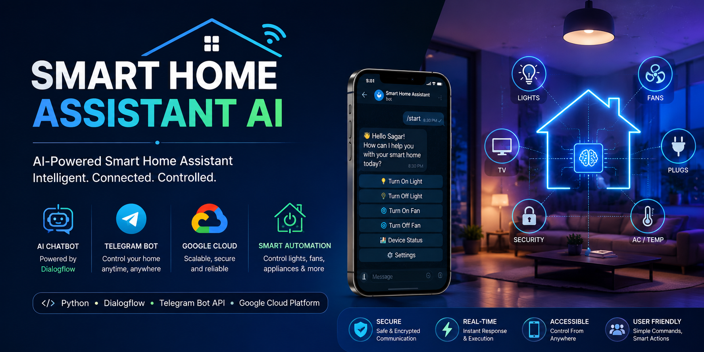
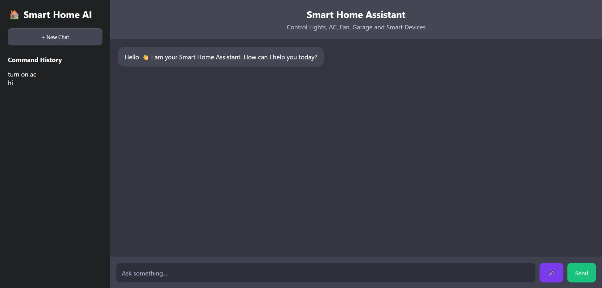
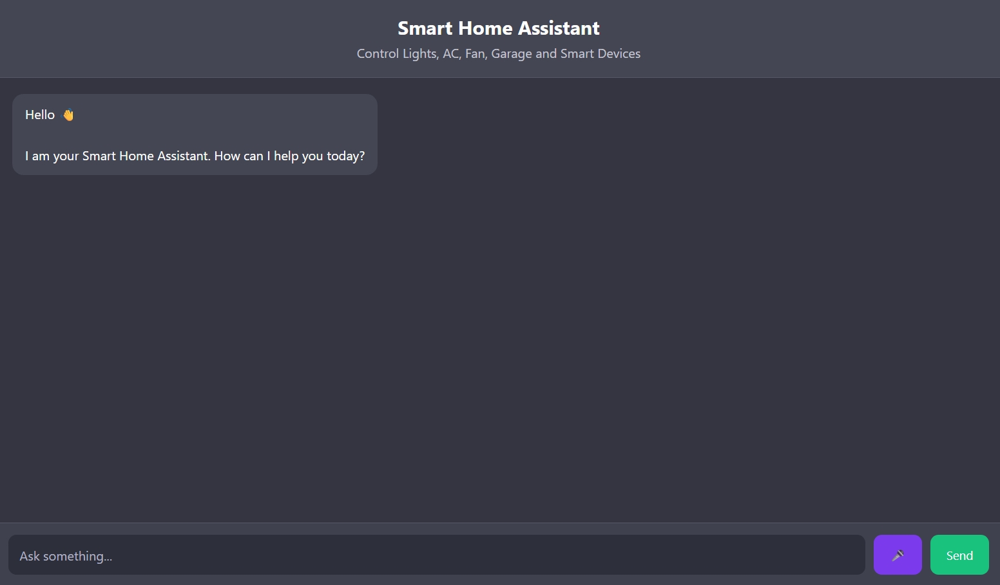
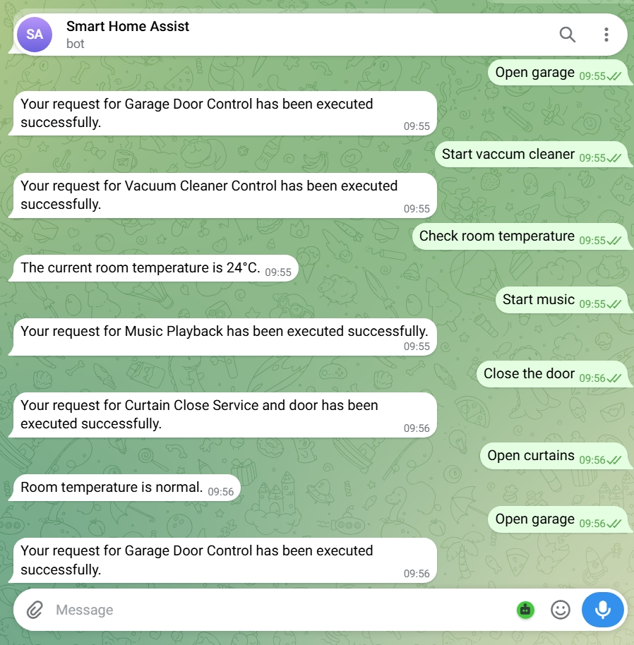
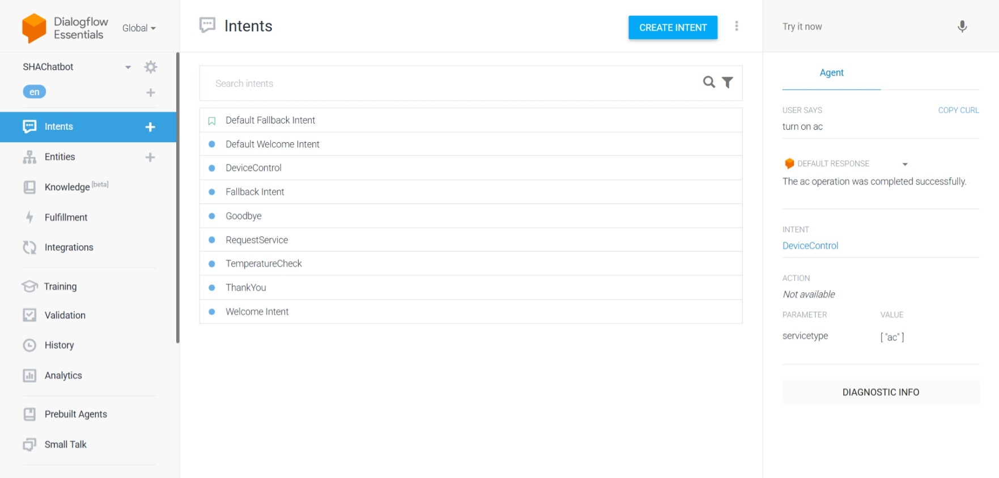

<p align="center">
  
</p>

# 🏠 Smart Home Assistant AI


---

## 📖 Project Overview

Smart Home Assistant AI is an intelligent home automation system developed using Dialogflow, Telegram Bot API, Python, Flask, and Google Cloud Platform.

The application enables users to control smart home devices through natural language commands, providing seamless interaction via chatbot and voice-based automation.

The system processes user requests using Dialogflow NLP, communicates through Telegram Bot API, and executes home automation commands through an integrated backend service.

---

## ✨ Features

### 🤖 AI Chatbot Assistant
- Natural language understanding
- Intent recognition using Dialogflow
- Conversational user experience

### 🏠 Smart Home Automation
- Light control
- Fan control
- Appliance management
- Device status monitoring

### 📱 Telegram Integration
- Remote smart home control
- Real-time command execution
- Mobile accessibility

### ☁️ Cloud Integration
- Google Cloud Platform
- Secure API communication
- Scalable deployment architecture

### 🔒 Security Features
- User authentication
- Protected API communication
- Secure command execution

---

## 🏗️ System Architecture

```text
User
 │
 ▼
Telegram / Web Interface
 │
 ▼
Dialogflow NLP Engine
 │
 ▼
Flask Backend Server
 │
 ├─────────────┬─────────────┬─────────────┐
 ▼             ▼             ▼             ▼

Device      Automation     Database      Logging
Control      Engine         Layer        Services

 │
 ▼
Google Cloud Platform
 │
 ▼
Smart Home Devices
```

---

## 🔄 Workflow

```text
User Command
      │
      ▼
Telegram Bot / Web UI
      │
      ▼
Dialogflow Intent Detection
      │
      ▼
Flask Backend Processing
      │
      ▼
Device Automation Engine
      │
      ▼
Smart Device Execution
      │
      ▼
Response Sent To User
```

---

## 🛠️ Technology Stack

### Frontend
- HTML
- CSS
- JavaScript

### Backend
- Python
- Flask

### AI & NLP
- Dialogflow

### Cloud Services
- Google Cloud Platform

### Communication
- Telegram Bot API

### Tools
- Git
- GitHub
- Visual Studio Code

---

## 📸 Application Screenshots

### 🏠 Homepage



---

### 💬 Chat Interface



---

### 🤖 Telegram Bot



---


### ☁️ Dialogflow Console



---

## 🚀 Installation

### Clone Repository

```bash
git clone https://github.com/Sagar-bv/Smart-Home-Assistant-AI.git
cd Smart-Home-Assistant-AI
```

### Install Dependencies

```bash
pip install -r requirements.txt
```

### Configure Dialogflow

1. Create a Dialogflow Agent
2. Configure Intents
3. Download Service Account Credentials
4. Place credentials file in project directory

### Configure Telegram Bot

1. Create Bot using BotFather
2. Obtain Bot Token
3. Update configuration

### Run Application

```bash
python app.py
```

---

## 📂 Project Structure

```text
Smart-Home-Assistant-AI
│
├── static/
├── templates/
├── screenshots/
│   ├── README.md
│   ├── homepage.jpeg
│   ├── chat-interface.jpeg
│   ├── telegram-bot.jpeg
│   ├── device-control.jpeg
│   └── dialogflow-console.jpeg
│
├── app.py
├── requirements.txt
├── banner.png
└── README.md
```

---

## 📊 Project Statistics

| Module | Status |
|----------|----------|
| Dialogflow Integration | ✅ Completed |
| Telegram Bot Integration | ✅ Completed |
| Flask Backend | ✅ Completed |
| Smart Device Automation | ✅ Completed |
| Intent Recognition | ✅ Completed |
| Google Cloud Integration | ✅ Completed |
| User Interface | ✅ Completed |
| Command Processing | ✅ Completed |

---

## 🎯 Future Enhancements

- Voice Assistant Integration
- IoT Device Connectivity
- Smart Energy Monitoring
- Mobile Application
- AI-Based User Behavior Analysis
- Multi-Language Support

---

## 💼 Internship Project

**Machine Learning Internship Project**

Developed as part of internship work involving:
- Dialogflow NLP
- Telegram Bot Development
- Google Cloud Services
- Smart Home Automation
- Python Backend Development

---

## 👨‍💻 Author

### Sagar B V

Master of Computer Applications (MCA)

GitHub: https://github.com/Sagar-bv

---

## ⭐ Support

If you found this project useful, consider giving it a ⭐ on GitHub.

---

### Smart Home Assistant AI
**Intelligent • Connected • Automated**
